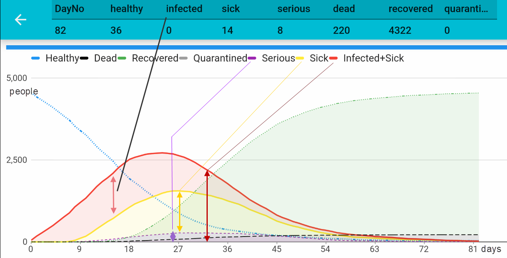

# The first run

After the first run you'll get a chart like shown below. With the default parameters you will see that almost all people will get infected and round about 4% to 5% will die.

The default setup simulates the situation when people simply ignore that the virus is serious (no preventive measures have been taken). So we let people move/behave as normal. Almost all people will get the infection and all this will happen very fast. Note: This was the initial approach in Great Britain and in the Netherlands. Both have stopped it. Interesting to see how this compares to our [second example](secondExample.md), later.

### Changes in the latest version

Lately, I heard about the 60% to 70% rate of infection: "*C19-Virus: 60% of UK population need to become infected so country can build 'herd immunity', government's chief scientist says*" (ref. [Independent](https://www.independent.co.uk/news/health/coronavirus-herd-immunity-uk-nhs-outbreak-pandemic-government-a9399101.html)). This phenomenon is called "[herd immunity](https://www.technologyreview.com/s/615375/what-is-herd-immunity-and-can-it-stop-the-coronavirus/)", but the numbers when this will happen differ.

I have implemented to 60% to 70% of the population has got the infect:

The diagrams shows this *herd immunity* effect with a lighter red line when 60% of the population is sick together with a solid blue line. After the 70% limit has been reached, the chart will become again a bit lighter to illustrate the worst lies behind.

## The chart explained

y-axis:	Number of people

x-axis:	Day No. 

> It is important to notice, the *Days* are not real days! In fact, it is more the *number of simulation turns* until the break-out will reach its end.  Take this number to compare charts with other simulation runs to  see how your changes may impact the duration of the break-out at all. (In [example 2](secondExample.md) we will restrict people's movements and you will see, the duration of the break-out changing significantly).

### Lines

| Line Color | Meaning                                                      |
| ---------- | ------------------------------------------------------------ |
| Blue       | Healthy people, not yet infected. At the end of the simulation see the `healthy=36` in the headline. This means, after 82 days out of a population of 4600 only 36 people did not get the infection. |
| Yellow     | People who are sick and may infect others                    |
| Red Line   | Total amount of people who are sick or infected only (no break-out yet). |
| Red Area   | The red area above the yellow line shows the number of infected people, which is the serious quantity! Those people move around and infect others without knowing they're infected.  |
| Purple     | People who are seriously sick and need professional assistance. This is obviously a serious number because it directly relates the capacity of the health system. |
| Green      | People who got infected but have recovered from Corona. Assumption is that if someone gets infected he won't get it again (that's how the simulation is designed!). |
| Black      | People who died because of Corona infection.   |

[go back](index.md)