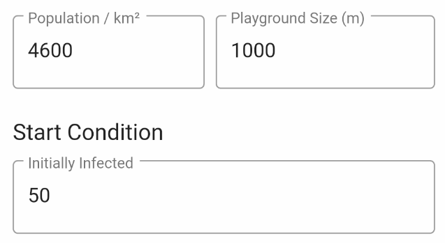

# Corona (COVID-19) outbreak simulation

A couple of days ago, I wanted to understand better how the Corona virus outbreak evolves under different conditions. Does it really help to stay at home? Would it help to have a vaccination? Or would it be more effective to quarantine infected people as early as possible (early warning system)? Which impact has the density of population etc.

> One important thing: 
>
> **Share this app faster than Corona and we will succeed!** 

I invented a simple model to simulate the Corona outbreak and how it infects people. My first model is called *Random Moves*. I have other models in mind ... let's see how this app evolves.

If you're interested in some more background information, you may read about "[the hammer and the dance](https://medium.com/@tomaspueyo/coronavirus-the-hammer-and-the-dance-be9337092b56)".

## Random Moves Model

The idea is simple:

> Take a playground of a certain size, for example, 1000x1000. Drop a number of people on this area. Infect some of them with COVID-19, and let them **randomly move** , meet and infect each other.

Simple as that!

A density of 4600 people per km² represents **Munich (Germany)**.  

According to *Wikipedia*, [New York Citys](https://en.wikipedia.org/wiki/New_York_City) density is:  Density= 10715/km², [Milan](https://en.wikipedia.org/wiki/Milan) is: 7700/km².  Find the city of your choice ... . For now, leave the 4600, click on the `Start` button and see how it evolves...

> [TIP]: It is better to turn you mobile to Landscape Mode. Please be patient, as it takes some seconds to load the chart. There is no slider - the chart will move itself to show you progress over time.

[Analyze the results of your first simulation.](firstExample.md)

[Let people move less - the second example.](secondExample.md)

[Early recognition - the third example](thirdExample.md).

Now it is up to you ... 

You may change the `Infection Probabability` which determines the probability a healthy person will get infected if it comes closer than `Infection Distance` to an infected, sick person. Infection Probability when persons "meet".

### Vaccination

If we had a vaccination, for example, the `infection probablity` would go down to a certain limit, e.g. 30%. This is due to the fact<u>s</u>: a) not all people will get vaccination and b) vaccination will not prevent all people from getting infected.

It your turn! Find out the best solution! 

## How does this map to reality?

It does not map to reality at all, because reality is much more complex. This simulation is just for fun! 

However, it may give you some impressions how different approaches to tackle the break-out may perform.

## Other models

I was thinking, that especially other movement models may change the results of the simulation. For example, *magnetic points*. The idea behind is, to implement some points on the map where people tend to go to more often, for example, supermarkets, U-Bahn, etc. This was to simulate these 'meetings points' a bit better.

Another model could be to simulate the "stay at home" approach a bit better. Lock a certain number of people in a room - let these groups moves less etc.

You see, there are many more ideas...

Enjoy it, anyways, **MarkusS**
(Markus Schmidt, Germany)