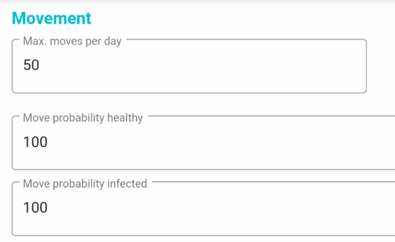
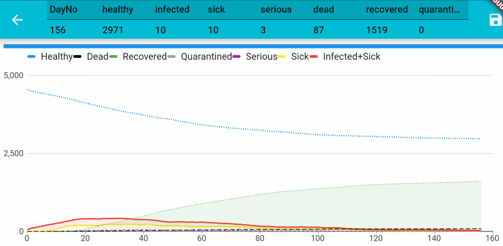
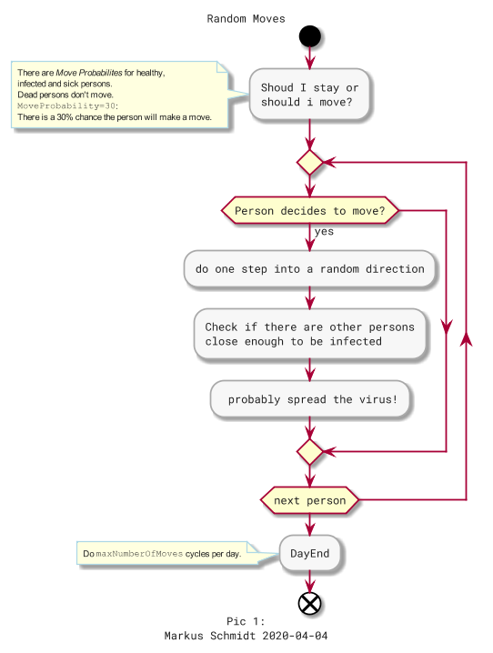

# Let people move less

## The second example

In the second example we restrict movement of people - this is the only parameter we change. However, before we do this second simulation you need to understand how *Movement works*.

## Movement

Each person can do `maxMovesPerDay`. Before each move, a person decides to make a move or not, based on a certain probability.

For example, `100` means each person will definitely do `maxMovesPerDay`. 

If you wanna reduce movement, set `Move Probability=25` so that there only a chance of 1:4 (=25%)  a person will make a move. This represent the government's *Stay At Home* advice.

For the second example, change **Move probability (for healthy and infected) to 25%**.

Isn't that interesting? See how many people have not got infected at all and how shallow the curve is! However, nothing is for free: look at the timing! It would take 160 "days" compared to only 80 of the first "let it go" example. Will our economy survive if we move less?

## Moves in detail

[go back](~/index.md)