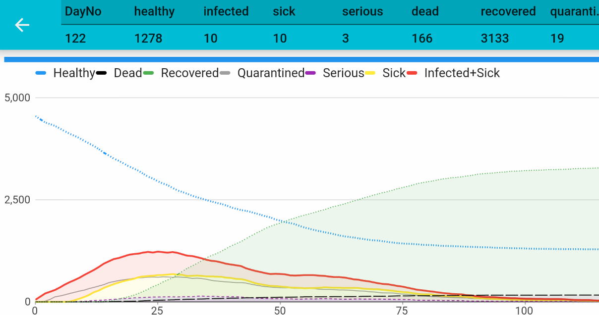

# Early recognition

The simulation allows us to *place people under quarantine*. Quarantined people won't infect others anymore because they are in a (virtual) place where only quarantined people live and which is not accessible for other healthy people. Of course, humans rights etc.  .. sure, we would never do this in reality today. But, read about *leprosy* and how this was handled at the times when there was no medicine against it: quarantine!

## The third example

Ok, lets simulate! Set back the `Move Probablity` from example two to 50 / 100 / 100 or restart the app .

Instead, change the `Quarantine probablity after infect to 50%`. 

This means: 2 to 5 days after someone got infected we will recognize its infection and put 50% of those people into quarantine to avoid they infect others.

See the grey line evolving from the ground. This is the number of people under quarantine. Interesting to see the shallow curve for *seriously* infected people. And watch the duration of the break-out: it takes around only 100 days.

One more thing: you could probably see ***"[the dance"***](https://medium.com/@tomaspueyo/coronavirus-the-hammer-and-the-dance-be9337092b56) that comes behind "the hammer" (behind the maximum - between day 50 and 75). "The dance" is the longer-term effort to keep this virus contained until there’s a vaccine. This is the time when infection rates may go up again depending on peoples behavior. 

> Important note: we are simulating *random moves*. If you see *the dance* as in the picture above depends on how your simulation goes. Each simulation run will show you different results.

Last but not least, look at the blue curve: how many people have not been infected at then end?

[go back](index.md)
